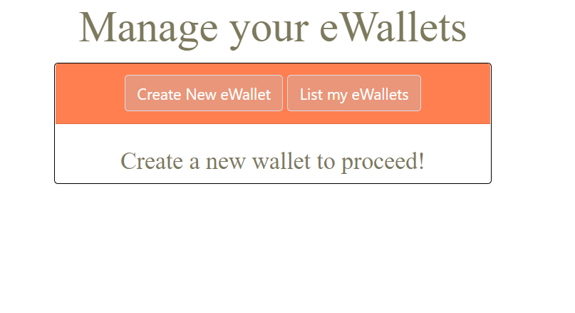
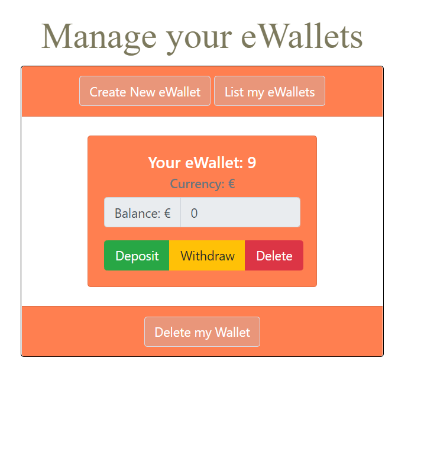
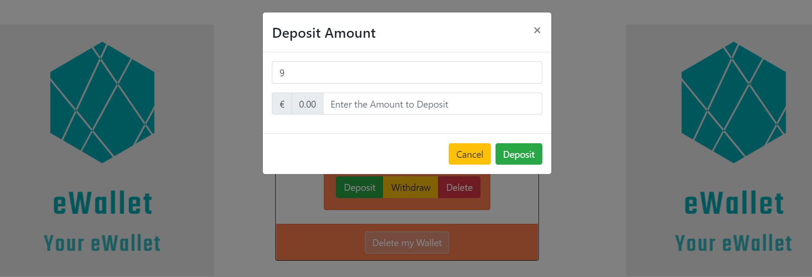
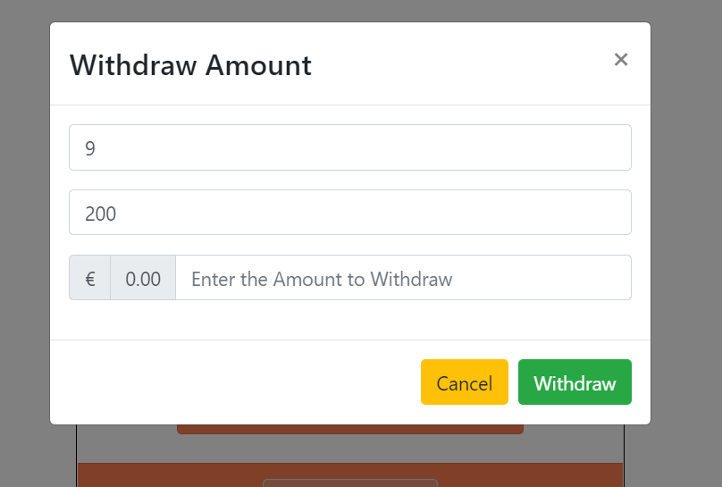
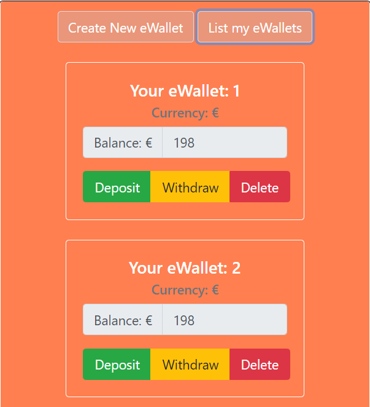

The e-Wallet Frontend Part, which communicates with the REST APIs exhibited by the e-Wallet Backend.

Technologies used: JavaScript ES6, React.js, Material-UI, React+Bootrsrap.

#How to Run:

1. Clone this repo to your local machine
2. Unzip and open the project folder with your preferred Code Editor App
3. Run: npm install
4. RUn: npm start

Some UI Screenshots:

